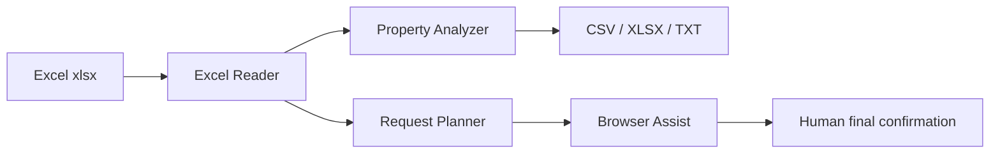

# Shinchiku Land Searcher AI

ExcelのA列に入っている物件URLを読み取り、資料請求の準備と物件の再分析・優先順位付けをCLIで実行するツールです。

> 重要: 外部サイトへの資料請求は実際の問い合わせ・営業連絡につながります。このツールは標準では最終送信を自動クリックせず、URLを開く、資料請求導線を探す、入力補助を行い、送信直前で人間確認に止めます。CAPTCHA、ログイン、利用規約、robots、サイトの明示的な制限を迂回しません。

## できること

- Excel / xlsx のA列URLを読み取り
- 物件行を再分析し、検討優先順位をCSV / Excel / TXTで出力
- APIキーなしのローカルスコアリング
- 任意で OpenAI / Anthropic API を使った補足コメント生成
- 資料請求URLの一覧化、重複排除、チェックリスト作成
- Playwrightを使った資料請求ページの半自動入力支援
- Codex / Claude で改修しやすい `CODEX.md` / `CLAUDE.md`
- GitHub Actions CI、テスト、devcontainer

## 想定入力

```powershell
G:\マイドライブ\AI_Agents\github\repos\Shinchiku_Land_Searcher\final_output\Apartment_Investment_Master.xlsx
```

A列にURLが入っている前提です。1行目をヘッダーとして扱います。ヘッダーが無い場合は `--no-header` を付けてください。

## ローカル実行

```bash
python -m venv .venv
source .venv/bin/activate  # Windows: .venv\Scripts\activate
pip install -e ".[browser,ai]"
python -m playwright install chromium
cp config.example.yaml config.local.yaml
```

### 物件を分析する

```bash
python -m shinchiku_land_searcher analyze \
  --input "G:\マイドライブ\AI_Agents\github\repos\Shinchiku_Land_Searcher\final_output\Apartment_Investment_Master.xlsx" \
  --url-column A \
  --output-dir outputs
```

出力: `outputs/ranking.csv`, `outputs/ranking.xlsx`, `outputs/advice.txt`, `outputs/request_plan.csv`

### 資料請求の準備をする

一覧だけ作る場合:

```bash
python -m shinchiku_land_searcher request \
  --input "G:\マイドライブ\AI_Agents\github\repos\Shinchiku_Land_Searcher\final_output\Apartment_Investment_Master.xlsx" \
  --output-dir outputs \
  --no-browser
```

ブラウザで入力補助する場合:

```bash
python -m shinchiku_land_searcher request \
  --input "G:\マイドライブ\AI_Agents\github\repos\Shinchiku_Land_Searcher\final_output\Apartment_Investment_Master.xlsx" \
  --output-dir outputs \
  --config config.local.yaml \
  --limit 10
```

このコマンドは各URLを開き、資料請求・お問い合わせ導線を探し、フォーム入力候補を補助します。最終送信は画面を確認して手動で行います。

### 分析と資料請求準備をまとめて実行

```bash
python -m shinchiku_land_searcher run \
  --input "G:\マイドライブ\AI_Agents\github\repos\Shinchiku_Land_Searcher\final_output\Apartment_Investment_Master.xlsx" \
  --output-dir outputs \
  --config config.local.yaml \
  --no-browser
```

## AIプロバイダー

標準は `local` で、APIキー不要です。OpenAIを使う場合は `OPENAI_API_KEY`、Anthropicを使う場合は `ANTHROPIC_API_KEY` を環境変数で設定してください。

## 本番運用に必要なもの

- Python 3.11+
- 入力Excelファイル
- 資料請求用の連絡先情報を入れた `config.local.yaml`
- ブラウザ入力補助を使う場合は Playwright Chromium
- AIコメントを外部LLMで生成する場合のみ `OPENAI_API_KEY` または `ANTHROPIC_API_KEY`

## CI/CD

GitHub Actions は push / pull_request / workflow_dispatch で実行されます。テスト、ruff、サンプルExcel分析、成果物artifact作成を行います。

## アーキテクチャ

詳細は [`docs/architecture.md`](docs/architecture.md) を参照してください。


