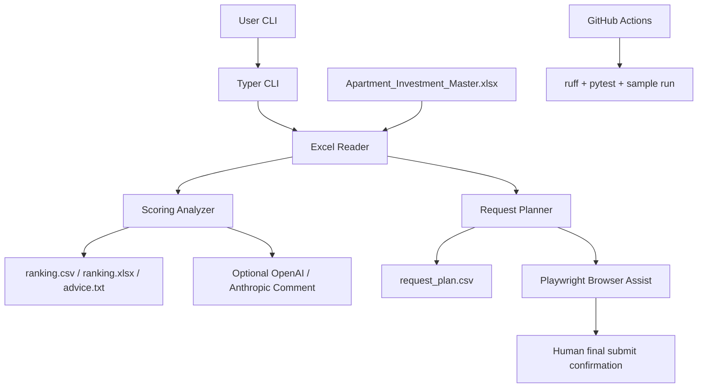

# Architecture

## 全体像

このrepoは、Excelを入力として「物件分析」と「資料請求準備」をCLIで行うPythonアプリです。GitHub ActionsではサンプルExcelを作成し、分析・出力生成まで確認します。

## 入力

- `.xlsx` ファイル
- デフォルトでA列をURL列として扱う
- 1行目をヘッダーとして扱う
- ヘッダーがない場合は `--no-header`

## 主要コンポーネント

| コンポーネント | ファイル | 役割 |
| --- | --- | --- |
| CLI | `src/shinchiku_land_searcher/cli.py` | `analyze`, `request`, `run` コマンド |
| Excel Reader | `excel_reader.py` | xlsxを読み、行データを保持 |
| Scoring | `scoring.py` | 利回り、価格、駅徒歩、築年数、リスクキーワードで順位付け |
| AI Advisor | `ai_advisor.py` | local / OpenAI / Anthropic の補足コメント |
| Reports | `reports.py` | CSV / XLSX / TXT / request_plan.csv 出力 |
| Request Assist | `request_assistant.py` | URLを開き、資料請求導線とフォーム入力を支援 |

## 資料請求の安全設計

外部サイトへの自動送信は、実際の問い合わせ・営業連絡・規約違反につながる可能性があります。そのため標準実装は次の方針です。

- 最終送信ボタンは自動クリックしない
- CAPTCHAやログインを迂回しない
- URLごとに人間が画面確認する
- 実行ログとスクリーンショットを残す
- `--no-browser` でブラウザを開かず一覧だけ作れる

## データ出力

- `ranking.csv`: 機械処理しやすい順位表
- `ranking.xlsx`: Excelで確認しやすい順位表
- `advice.txt`: 検討順・注意点
- `request_plan.csv`: 資料請求準備リスト
- `request_log.csv`: ブラウザ補助実行ログ
- `screenshots/`: 各URLの確認用スクリーンショット

## Secrets

GitHub Actionsの通常テストにはSecrets不要です。外部AIを使うローカル運用では環境変数を使います。

- `OPENAI_API_KEY`
- `OPENAI_MODEL` 任意
- `ANTHROPIC_API_KEY`
- `ANTHROPIC_MODEL` 任意

## 今後の拡張案

- 物件種別ごとのスコアリング重み調整
- Google Drive / Dropboxからの入力取得
- 重複物件検出
- 物件URLごとのサイト別フォームマッピング
- 資料取得後のPDF / 画像OCRと再評価
- 融資条件を入れたキャッシュフロー分析
